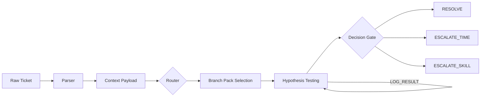

# Service Desk Copilot

AI-powered troubleshooting orchestration for MSP service desks — structured triage, deterministic routing, and guided resolution with built-in safety guardrails.

> **Production status:** The GPT runtime (`runtime/`) is deployed and handling live tickets. The Python agent, REST API, and React dashboard are engineering prototypes that demonstrate the full architecture.

---

## Architecture

### Ticket Flow



A raw ticket paste is parsed into a structured context payload. The router selects a branch pack (troubleshooting playbook) using taxonomy-first matching with keyword fallback. The operator runs diagnostic commands, logs results, and the system narrows hypotheses until a decision is reached.

### Four Pillars

| Pillar | Purpose |
|:--|:--|
| **Job Context** | Tooling environment, runtime file references, priority/SLA tracking |
| **PS Guardrails** | Three-tier PowerShell safety model with STOP blocks for change-making commands |
| **Ticket State** | Basic troubleshooting guardrail, hypothesis discipline, CSS scoring, decision mode |
| **Memory + Comms** | Resolved case matching, SOP surfacing, templated communications |

### Context Sufficiency Score (CSS)

CSS is a deterministic 0–100 measure of context completeness — a gut-check signal, not a gate. It tells the operator whether they have enough context to act or need to gather more.

| Domain | Weight | What It Measures |
|:--|:--|:--|
| Evidence Strength | 35% | Diagnostic results, tests run |
| Branch Quality | 20% | Active hypotheses, collapse notes |
| Symptom Specificity | 15% | Symptoms documented, impact assessed |
| Environment | 10% | Hostname, asset tag, serial number |
| Timeline & Changes | 10% | Problem start, recent changes, last known good |
| Constraints & Risk | 10% | Security tool presence, blast radius (single vs. multi-user) |

Hard caps enforce guardrails — e.g., CSS maxes at 50 if hostname is unknown.

### Branch Pack Selection

55 branch packs organized across 8 categories: network, identity, m365, messaging, security, endpoint, infrastructure, and cross-cutting.

**Selection flow:**
1. Extract Issue Type + Sub-Issue Type from ticket (Autotask taxonomy)
2. Look up packs via `taxonomy_pack_mapping.yaml` (deterministic)
3. If no taxonomy match, fall back to keyword matching against ticket summary + body
4. Load primary pack + optional cross-cutting fallback (max 2)
5. Log routing metadata for observability (`taxonomy` vs. `keyword`, match explanation)

### PowerShell Safety Tiers

| Tier | Catalog | Behavior |
|:--|:--|:--|
| **Diagnostics** | `powershell_diagnostics_catalog.yaml` | Read-only. Run freely. |
| **Nondisruptive** | `powershell_nondisruptive_catalog.yaml` | Safe changes. Run with awareness. |
| **Operations** | `powershell_operations_catalog.yaml` | Change-making. **Requires STOP block.** |

**STOP block pattern:** Before any change-making command, the system emits a structured block with the proposed change, rationale, risks, and rollback plan. The operator must explicitly approve with `UNLOCK_CHANGES`, which authorizes only the next step.

---

## What's in Production

The `runtime/` directory contains the GPT Knowledge files that power the deployed Custom GPT.

| File | Purpose | Notes |
|:--|:--|:--|
| `router.txt` | Master system prompt | 4 pillars, operating loop, command reference. 8K char hard limit (GPT constraint). |
| `branch_packs_catalog_v1_0.yaml` | 55 troubleshooting playbooks | Taxonomy-mapped, keyword-indexed |
| `powershell_diagnostics_catalog.yaml` | Read-only PS commands | Safe to run without approval |
| `powershell_nondisruptive_catalog.yaml` | Low-risk PS commands | Run with awareness |
| `powershell_operations_catalog.yaml` | Change-making PS commands | Require STOP block |
| `comms_templates/templates.yaml` | Email/note templates | DRAFT_* command output |
| `kb_articles/sops.yaml` | IR playbooks + Inky reference | Incident response SOPs |
| `resolution_logs/resolved_cases.yaml` | Resolved case memory | Pattern matching for similar tickets |
| `command_palette.md` | Operator command reference | All available commands |

---

## Engineering Prototypes

### Python Agent Runtime (`scripts/`)

Local agent that mirrors the GPT runtime with deterministic routing and full observability.

```
scripts/
├── agent/       # Agent loop, command handler, CSS calculator, CP manager
├── core/        # Field path constants, exceptions, result models
├── parsing/     # Ticket parser, PII-scrubbing variant, branch pack selector
├── analytics/   # Pattern detection, confidence scoring, resolution logging
├── pipeline/    # Ticket ingestion watcher, payload generation
├── qa/          # Routing dashboard, pack coverage analysis
└── tests/       # pytest suite, fixtures, smoke tests
```

### REST API (`api/`)

FastAPI service exposing ticket context, command catalogs, and branch pack metadata.

- `GET /api/v1/tickets/{id}` — fetch context payload
- `GET /api/v1/commands/...` — search PowerShell catalogs
- `GET /api/v1/branch-packs/...` — pack metadata and search
- `WebSocket /api/v1/tickets/{id}/stream` — real-time ticket updates
- Optional `X-API-Key` authentication

### React Dashboard (`web/`)

Three-panel workbench UI for visualizing ticket state and troubleshooting progress.

- **Left sidebar:** Ticket list
- **Main area:** Ticket summary, hypotheses, evidence log
- **Right panel:** CSS gauge, domain scores, blockers, decision gate

---

## Tech Stack

| Layer | Stack |
|:--|:--|
| GPT Runtime | OpenAI Custom GPT + Knowledge files |
| Agent | Python 3.10+, PyYAML, NetworkX, NumPy |
| API | FastAPI, Uvicorn, Pydantic, WebSockets |
| Web | React 19, TypeScript, Vite, Tailwind CSS, Zustand, TanStack Query, Recharts |
| Testing | pytest, pytest-cov, pytest-xdist |

---

## Testing

```bash
# Run full test suite
pytest scripts/tests/ -v

# Run with coverage
pytest scripts/tests/ -v --cov=scripts --cov-report=term-missing

# Smoke test (manual regression)
# See tests/smoke_test.md for the 10-scenario harness
```

---

## Design Decisions

**8K character limit forcing compression.** The GPT Custom GPT Knowledge file constraint (8K chars for `router.txt`) forced aggressive compression of the system prompt. Every word earns its place. This constraint shaped the four-pillar architecture — each pillar is a self-contained section that fits within the budget.

**Taxonomy-first routing.** Branch pack selection uses the Autotask Issue/Sub-Issue taxonomy as the primary routing signal, not keyword heuristics. This gives deterministic, auditable routing for any ticket that has structured fields. Keyword matching is the fallback, not the default.

**CSS as signal, not gate.** The Context Sufficiency Score tells the operator whether context is thin or rich. It never blocks a decision. A low CSS means "prioritize clarifiers"; a high CSS means "enough to act." This avoids the failure mode where automation refuses to help because a score is below a threshold.

**STOP block as change gate.** Any PowerShell command that modifies state requires a structured approval block before execution. `UNLOCK_CHANGES` approves only the immediately next step — not a blanket authorization. This prevents accidental destructive operations while keeping the operator in control.

---

## License

MIT — see [LICENSE](LICENSE).
